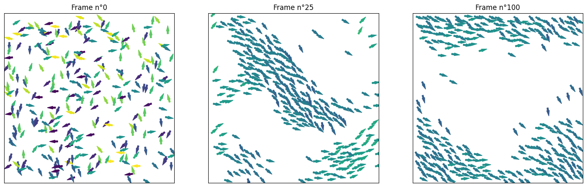

# Vicsek Model: A Simulation of Collective Motion

This project simulates the collective behavior of a group of agents (for example, birds) using a model inspired by the Vicsek model. The goal is to observe the emergence of collective behaviors, such as the formation of schools (of fish) or flocks (murmuration), from simple local rules.



## Features

*   Simulation of self-propelled agents (prey and predators) with constant velocities.
*   Agent orientation update based on:
    *   **Alignment**: Prey align with neighbors within a `radius_influence`.
    *   **Fleeing**: Prey actively flee from predators within `radius_predators`. The `weight_afraid` parameter modulates the intensity of this reaction.
    *   **Hunting**: Predators target and move towards the nearest prey.
    *   **Noise**: A random noise term (`diffusion`) affects the orientation of all agents.
    *   **Coupling**: A `couplage` coefficient controls the strength of the alignment behavior for prey.
*   Collision avoidance mechanism (`dont_touch_predator`) to prevent agents from overlapping, using different distances for prey-prey (`radius_avoid`) and prey-predator (`radius_predators`) interactions.
*   Periodic boundary conditions (agents that exit one side of the box reappear on the other).
*   Calculation and storage of the order parameter over time (`param_ordre`).
*   Animated visualization of the simulation (`plot_run`).
*   Vectorized functions (NumPy) for improved performance.

## Model

> ⚠️ **Warning**
> The predator-prey interaction is still under development. In the current implementation, prey are pushed away from predators to avoid direct overlap, but the logic for them to proactively change their direction to flee is not yet fully effective.

The model simulates `n_preys` and `n_predators` agents moving in a square box of size `2 * window_width` by `2 * window_width`. At each `time_step`, the position and angle of each agent are updated:

1.  **Angle Update (`theta_update`)**:
    *   **Prey**: The angle of each prey is a weighted combination of aligning with neighboring prey and fleeing from nearby predators. The `weight_afraid` parameter increases the priority of fleeing.
    *   **Predators**: Predators target and move towards the nearest prey within their detection range. If no prey is near, they move randomly.
    *   All agents are subject to random angular noise controlled by `diffusion`.
2.  **Position Update (`pos_update_predator`)**: The position is updated based on the agent's velocity and its new angle.
3.  **Collision Avoidance (`dont_touch_predator`)**: If agents get too close, their positions are adjusted to separate them. The separation distance is `radius_avoid` for agents of the same type and `radius_predators` for prey-predator pairs.
4.  **Boundary Conditions**: Agents are kept within the simulation box via periodic conditions.

## Main Parameters

*   `time_tot`: Total number of time steps (frames).
*   `n_preys`: Number of prey agents.
*   `n_predators`: Number of predator agents.
*   `radius_influence`: Interaction radius for prey alignment.
*   `radius_avoid`: Minimum distance between agents of the same type to avoid overlap.
*   `radius_predators`: Radius within which prey detect and flee from predators. Also serves as the minimum prey-predator distance.
*   `velocity_prey`: Speed of prey.
*   `velocity_predator`: Speed of predators.
*   `time_step`: Simulation time step.
*   `window_width`: Half-width of the simulation box (domain from `-window_width` to `window_width`).
*   `diffusion`: Angular diffusion coefficient (strength of the random noise).
*   `couplage`: Coupling coefficient (strength of the alignment for prey).
*   `weight_afraid`: Fear factor for prey. A higher value makes prey prioritize fleeing over alignment.

## Prerequisites

*   Python 3.x
*   NumPy
*   Matplotlib
*   tqdm (for the progress bar)
*   IPython / Jupyter Notebook (for `clear_output` in animations)

You can install the necessary dependencies with pip:
```bash
pip install -r requirements.txt
